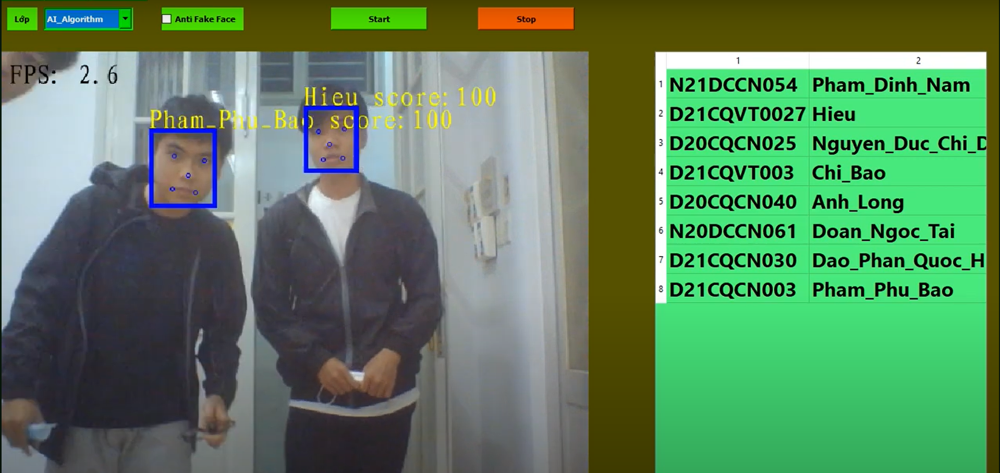
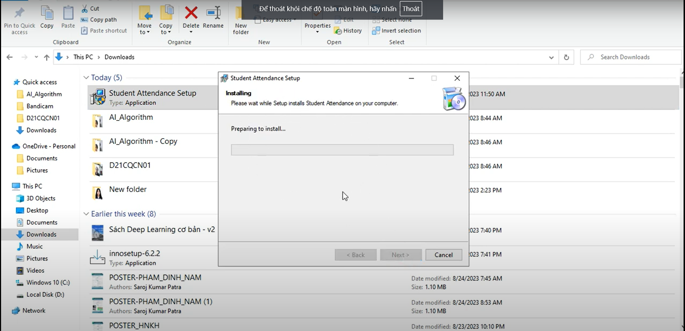
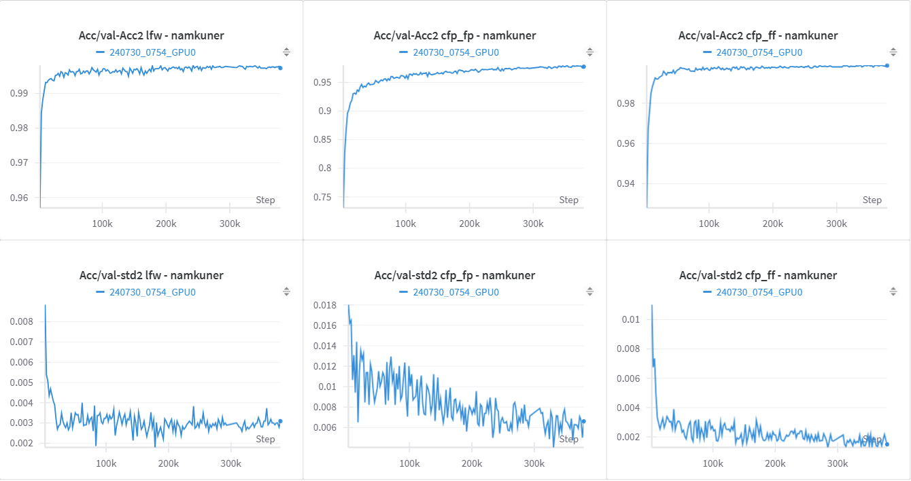

# 📷 Ứng dụng Điểm Danh Sinh Viên Bằng Nhận Diện Khuôn Mặt

Ứng dụng giúp giảng viên điểm danh sinh viên tự động qua camera laptop bằng nhận diện khuôn mặt. Sử dụng một số model tiên tiến hiện tại, nhẹ và chạy realtime được ở trên các laptop.
---

## 🎬 Điểm danh ở lớp chuyên đề AI của Naver 

---

## 🎬 Demo nhanh

https://github.com/user-attachments/assets/4817743f-f5c2-40ee-afaf-a1d51b08a471

---

## 📖 Hướng Dẫn Sử Dụng

---

## 🧠 Train model với dataset Glint360k hơn 17 triệu ảnh

[Github train Ghostfacenets](https://github.com/namkuner/Distributed_GhostFaceNet_Train_on_Glint360k)
---
## So sánh (Có thể xem ở Wandb hoặc train.log)
|   Tập dữ liệu     | LFW            | CFP-FP         | CFP-FF
|-------------------|----------------|----------------|----------------|
| Kết quả của tôi   | 99.800         | 98.014         | 99.871         |
| Của paper gốc     | 99.717         | 93.071         | 96.55          |

[![Paper gốc]](https://github.com/HamadYA/GhostFaceNets)

## 🧠 Link tải phần mềm và cài đặt

[Download phần mềm](https://drive.google.com/file/d/1KXzdPSi0JuuI-WpjziLvGTwqjGK138yA/view?usp=sharing)

...

